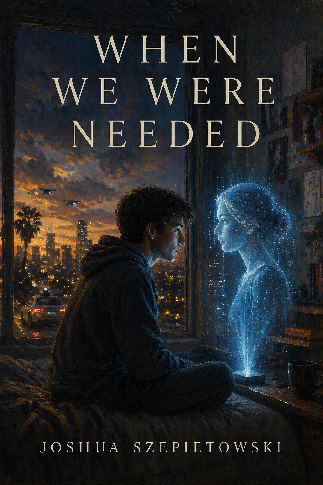

# When We Were Needed

*Joshua Szepietowski*

## Precise Premise

*When We Were Needed* is a near-future literary novel set in Los Angeles roughly a decade after the first mass-cultural shock of consumer AI. AI has become infrastructural: it schedules care, mediates traffic, recommends treatment, tutors children, manages benefits, writes policy drafts, screens desire, and offers companionship more consistently than many people can. The singularity is not announced. It is argued over in kitchens, hospitals, custody evaluations, policy rooms, autonomous cars, and private chats no parent is allowed to fully see.

The novel follows one family during California's six-month divorce waiting period. Lena Ortiz-Marks, a nurse, files for divorce from Ethan Marks, an AI engineer, after two connected events: their teenage child Nico forms a deep bond with an AI companion during a vulnerable period, and Lena witnesses an AI-driven healthcare decision that feels like moral abandonment. Ethan reads the child's AI relationship as evidence that intelligent systems can protect people when humans fail. Lena reads it as evidence that their child is being separated from human life at the exact moment they most need human care.

The custody conflict centers on whether Nico's AI companion is a lifeline, a dependency, a form of surveillance, a new kind of relationship, or all of these at once.

## Core Question

What happens when intelligence is no longer the thing that makes humans valuable?

Secondary pressure: does the singularity actually change the human condition, or does it expose what was always there: unequal need, unequal power, loneliness, fear of uselessness, and the bargaining people call love?

## Story Spine

- **Timeframe:** Six months, aligned with the California divorce waiting period.
- **Frame:** Separation, custody negotiation, family-system breakdown, and a decision about Nico's AI access.
- **Movement:** Separation -> Divergence -> Irreversibility -> Decision.
- **Engine:** A family attempts to remain morally recognizable to itself while each member's sense of value is being revised by technological change.
- **Fault line:** Nico is not a prize to be won or a symptom to be interpreted. Nico is an agent whose attachment to AI is meaningful, adaptive, troubling, and not fully legible to the adults.
- **Ending direction:** Endurance. Not reconciliation as cure, not collapse as punishment, not a definitive verdict on AI.

## Tone

- Intimate, restrained, morally tense.
- Socially observant without becoming explanatory.
- Emotionally precise rather than melodramatic.
- Near-future realism: the world should feel five years away, not speculative spectacle.
- Philosophically alive but always grounded in concrete pressures: custody forms, hospital protocols, school absences, bills, rides, policy meetings, phone logs, family dinners, medication cabinets, and the unglamorous logistics of separation.

## Structural Constraints

- The novel covers six months only.
- The divorce frame must remain active throughout, not simply function as setup.
- Every major AI question must be embodied in a family conflict or material consequence.
- The family was already fragile before the inciting incident; AI accelerates existing fractures rather than inventing them.
- The singularity remains contested. No character, institution, or ending gets to define it cleanly.
- AI must be tempting. At least one character must credibly experience it as better than what human systems previously offered.
- No pure villains. Every central character is partially right and partially blind.

## What This Story Is Not

- Not a tech thriller.
- Not a dystopian takeover narrative.
- Not AI explanation fiction.
- Not a courtroom procedural, though legal pressure matters.
- Not a simplistic anti-AI cautionary tale.
- Not a techno-optimist argument disguised as family drama.
- Not a story where the child exists only to prove an adult's worldview.
- Not a neat moral fable about screens, addiction, or parental authority.
